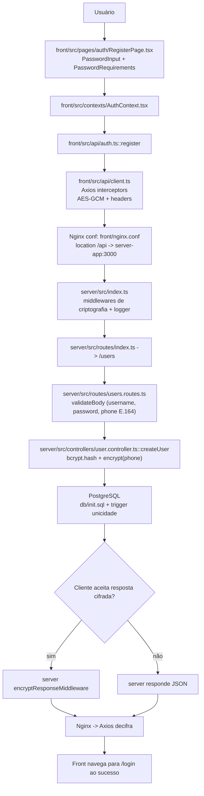

# Testes de segurança

Este monorepo demonstra como estruturar, testar e operar uma aplicação full‑stack com foco em segurança e observabilidade.

- Backend: Node.js + Express
- Frontend: React + Vite
- Banco: PostgreSQL
- Cache/blacklist: Redis
- Proxy/TLS: Nginx
- Infra: Docker / Docker Compose + GitHub Actions (CI)

Além dos fluxos E2E usuais (cadastro, login, MFA, troca de senha, logout), o projeto cobre criptografia em repouso e em trânsito, proteção contra MITM com TLS autoassinado, rate limiting e audit logging estruturado.

---

## Tecnologias e Recursos Principais

- Node.js + Express: API REST com bcrypt, JWT e integração PostgreSQL.
- React + Vite: SPA com AuthContext, roteamento e formulários resilientes.
- PostgreSQL: schema versionado (`db/init.sql`) com trigger de unicidade de username.
- Redis: rate limit, blacklist de JWT e cache de MFA.
- AES‑256‑GCM em repouso: criptografia do telefone armazenado no banco (chave em `DATA_ENCRYPTION_KEY`).
- AES‑256‑GCM em transporte: payloads sensíveis cifrados entre front e back, além do TLS (camada simétrica compartilhada; headers de controle nos middlewares).
- Pino + multistream: logger estruturado com redaction; saída em console e arquivo (`./logs/server/server.log` via volume).
- Nginx: reverse proxy do front e `/api` para `server-app:3000`, TLS com certificados autoassinados e cabeçalhos de segurança.
- Docker / Docker Compose: ambientes isolados para produção local e etapas de segurança.
- GitHub Actions (CI): Lint/Prettier (front/server), build TypeScript (server), build de imagem Docker + Trivy (tabela e JSON como artefato), Snyk (dependências Node com severidade “high” + artefato JSON) e Docker Bench Security via Docker Compose; usa concurrency com cancel‑in‑progress e publica artefatos.

---

## Estrutura de Pastas

```text
.
├─ .github/workflows/ci.yml        # Pipeline CI: lint/build/scans/bench + artefatos
├─ db/
│  └─ init.sql                     # Schema inicial do PostgreSQL (trigger de unicidade)
├─ front/
│  ├─ Dockerfile                   # Build do front + Nginx (produção)
│  ├─ nginx.conf                   # Reverse proxy + TLS (certificados locais)
│  ├─ nginx.main.conf              # Configuração global do Nginx
│  ├─ nginx.ci.conf                # Configuração Nginx usada no CI (sem TLS)
│  ├─ package.json                 # Scripts de dev/build/lint/format
│  ├─ public/favicon.ico           # Ícone da aplicação
│  └─ src/
│     ├─ api/
│     │  ├─ client.ts              # Axios + interceptors (camada AES‑GCM)
│     │  └─ auth.ts                # Endpoints de autenticação (login/MFA/senha)
│     ├─ components/
│     │  ├─ Header.tsx             # Header com navegação/autenticação
│     │  ├─ PasswordInput.tsx      # Campo de senha com mostrar/ocultar
│     │  └─ PasswordRequirements.tsx # Checklist dinâmico de requisitos
│     ├─ contexts/
│     │  ├─ AuthContext.tsx        # Contexto de autenticação
│     │  └─ useAuth.ts             # Hook do contexto
│     ├─ layouts/
│     │  ├─ AppLayout.tsx          # Layout autenticado
│     │  └─ AuthLayout.tsx         # Layout de autenticação
│     ├─ pages/
│     │  ├─ DashboardPage.tsx      # Página protegida
│     │  └─ auth/
│     │     ├─ LoginPage.tsx       # Login + 2FA (SMS)
│     │     ├─ RegisterPage.tsx    # Cadastro com validação de senha forte
│     │     └─ ChangePasswordPage.tsx # Troca de senha
│     ├─ utils/
│     │  ├─ passwordRules.ts       # Regras de senha (compartilhadas)
│     │  └─ transportEncryption.ts # AES‑GCM no front (transporte)
│     ├─ styles/                   # Theming e estilos globais
│     ├─ App.tsx                   # Composição de rotas/layouts
│     └─ main.tsx                  # Bootstrap da aplicação
├─ server/
│  ├─ Dockerfile                   # Build da API (produção)
│  └─ src/
│     ├─ index.ts                  # App Express + middlewares + rotas
│     ├─ configs/
│     │  ├─ db.ts                  # Conexão PostgreSQL
│     │  └─ redis.ts               # Conexão Redis (rate limit/blacklist)
│     ├─ controllers/
│     │  └─ user.controller.ts     # Fluxos de autenticação/usuário
│     ├─ middlewares/
│     │  ├─ authMiddleware.ts      # JWT + blacklist de tokens
│     │  ├─ errorHandler.ts        # Tratamento centralizado de erros
│     │  ├─ rateLimit.ts           # Rate limit baseado em Redis
│     │  ├─ transportEncryption.ts # AES‑GCM (camada de transporte)
│     │  └─ validateBody.ts        # Validação de payload
│     ├─ routes/
│     │  ├─ index.ts               # Router raiz
│     │  └─ users.routes.ts        # Rotas de usuários/autenticação
│     ├─ services/
│     │  └─ sms.ts                 # Envio de SMS (Twilio)
│     ├─ utils/
│     │  ├─ encryption.ts          # Criptografia em repouso (AES‑GCM)
│     │  ├─ jwt.ts                 # Geração/validação de tokens JWT
│     │  ├─ logger.ts              # Logger Pino com redactions
│     │  └─ transportEncryption.ts # Helpers AES compartilhados
│     └─ types/express/index.d.ts  # Tipagens auxiliares (ex.: req.user)
├─ http/requests.http              # Exemplos REST (VSCode REST Client)
├─ logs/.gitignore                 # Mantém pasta de logs versionada
├─ docker-compose.yml              # Orquestração local (prod‑like)
├─ docker-compose.ci.yml           # Orquestração para CI (bench/security)
└─ .env                                                 
```

---

## Execução Local (Produção)

1) Clonar repositório

```bash
git clone https://github.com/arleysouza/2fa-atividade.git app
cd app
```

2) Gerar certificados autoassinados

Gere as chaves em `front/certs` (o Nginx do front termina o TLS):

Bash (Linux/macOS/Git Bash)
```bash
mkdir -p front/certs
openssl genrsa -out front/certs/privkey.pem 2048
openssl req -x509 -nodes -days 365 -new -key front/certs/privkey.pem -out front/certs/fullchain.pem
```

3) Configurar variáveis de ambiente do Twilio

Antes de subir os containers, configure no arquivo `.env` (na pasta `app/`):

```bash
TWILIO_ACCOUNT_SID=ACxxxxxxxxxxxxxxxxxxxxxxxxxxxxxxxx
TWILIO_AUTH_TOKEN=xxxxxxxxxxxxxxxxxxxxxxxxxxxxxxxx
TWILIO_FROM_NUMBER=+15551234567
```

Como obter e dicas de uso estão na seção [Variáveis de Ambiente do Twilio](#variaveis-de-ambiente-do-twilio). Sem essas variáveis, o backend falhará ao enviar o SMS de MFA no login.

4) Subir a aplicação

```bash
docker compose up --build -d
```

Front (Nginx):
- HTTPS: https://localhost:3443
- HTTP: http://localhost:3002 (apenas para testes)

O `server-app` fica acessível somente pela rede Docker (`app-network`); todo acesso externo passa pelo Nginx.

Para encerrar:
```bash
docker compose down -v
```

---

## Criptografia e Segurança

- Repouso: telefones são cifrados com AES‑256‑GCM antes de persistir no PostgreSQL (`server/src/utils/encryption.ts`).
- Transporte: em rotas sensíveis, payloads podem trafegar cifrados (camada simétrica com headers de sinalização) além do TLS.
- MFA: login exige código via SMS (Twilio).
- Rate limit: Redis + middleware previnem força bruta.
- Logging: Pino grava JSON no stdout e em `./logs/server/server.log` com redaction.
- Triggers de DB: `db/init.sql` garante unicidade de `username` em insert/update.  


---

## Logger Estruturado

- Variáveis (`LOG_DIRECTORY`, `LOG_FILE_NAME`, `LOG_LEVEL`, `LOG_PRETTY`, `DISABLE_FILE_LOGS`) no `.env` controlam saída e formato.
- Volume `./logs/server → /var/log/app`; arquivo `server.log` fica disponível no host.
- Middlewares e controllers usam `logger.*` (correlação via `req.id`, `userId`).

---

## Configurações do Nginx

- Arquivos principais
  - `front/nginx.main.conf`: configuração global (usuário, logs, includes).
  - `front/nginx.conf`: produção (HTTPS 443, SPA, proxy `/api`, redirect 80→443).
  - `front/nginx.ci.conf`: variante para CI (HTTP apenas, sem HSTS/TLS).

- Servidor HTTPS (produção)
  - `listen 443 ssl;` com certificados montados em `/etc/nginx/certs` (`fullchain.pem`/`privkey.pem`).
  - Cabeçalhos de segurança: HSTS, X‑Frame‑Options, X‑Content‑Type‑Options, Referrer‑Policy e CSP restritiva.
  - SPA: `try_files $uri /index.html` para suportar React Router.
  - Estáticos: cache para `ico|css|js|gif|jpg|png|woff|ttf|svg|eot` com `expires 6M` e `Cache‑Control: public`.

- Proxy da API
  - `location /api/ { proxy_pass http://server-app:3000/; ... }` (rede Docker interna).
  - Encaminha `Host`, `X‑Real‑IP`, `X‑Forwarded‑For`, `X‑Forwarded‑Proto`.
  - O `server-app` não publica portas no host; acesso externo só via Nginx.

- HTTP→HTTPS
  - Servidor em `80` redireciona para `https://$host:3443$request_uri`.
  - Portas externas configuráveis em `.env`: `FRONT_HOST_PORT` (HTTP) e `FRONT_HOST_PORT_SSL` (HTTPS).

- Docker
  - `./front/certs:/etc/nginx/certs:ro`, container `read_only` e `tmpfs` para cache/run/logs.
  - Healthcheck usa HTTP interno (`http://127.0.0.1:80/`) por simplicidade.

---

## Pipeline GitHub Actions (Atualizado)

`.github/workflows/ci.yml` executa:

1. Lint & Prettier (Server): `npm ci --prefix server`, `npm run lint --prefix server`, `npm run format:check --prefix server`.
2. Lint & Prettier (Front): `npm ci --prefix front`, `npm run lint --prefix front`, `npm run format:check --prefix front`.
3. Build TypeScript (Server): `npm run build --prefix server`.
4. Trivy Scan (Imagem Docker): build da imagem `server/Dockerfile`, saída em tabela (sem falhar o job) e relatório JSON `trivy-report.json` como artefato.
5. Snyk Scan (Node.js): análise de dependências com severidade `high` (requer `SNYK_TOKEN`); relatório JSON `snyk-node-report.json` como artefato.
6. Docker Bench Security: compõe stack com `docker-compose.yml + docker-compose.ci.yml`, aguarda healthchecks, executa `docker/docker-bench-security` e desmonta; relatório JSON `docker-bench-security.log` como artefato.

Como configurar o Snyk (token)
- Crie uma conta em https://snyk.io e copie o token em https://app.snyk.io/account
- No GitHub: Settings → Secrets and variables → Actions → New repository secret
- Nome: `SNYK_TOKEN` | Valor: seu token

---

## Requests HTTP

O arquivo `http/requests.http` contém exemplos de Registro, Login, MFA, Troca de Senha e Logout. Com a extensão REST Client (VSCode), basta abrir e clicar em “Send Request”.

---

<a id="variaveis-de-ambiente-do-twilio"></a>
## Variáveis de Ambiente do Twilio

MFA via SMS usa Twilio. Configure no `.env` (na pasta `app/`):

```bash
TWILIO_ACCOUNT_SID=ACxxxxxxxxxxxxxxxxxxxxxxxxxxxxxxxx
TWILIO_AUTH_TOKEN=xxxxxxxxxxxxxxxxxxxxxxxxxxxxxxxx
TWILIO_FROM_NUMBER=+15551234567
```

Como obter
- https://console.twilio.com/ → Project Info: copie `Account SID` e `Auth Token`.
- Phone Numbers: adquira um número e use como `TWILIO_FROM_NUMBER`.
- Use formato E.164 para todos os números (ex.: `+55DDDNUMERO`).

Execução local
- O `docker-compose.yml` injeta essas variáveis do `.env` no `server-app`.
- Sem estas variáveis, o backend lança erros ao enviar SMS.

Opções sem SMS real
- Use as Test Credentials do Twilio (não entrega SMS).
- Alternativa de desenvolvimento: fazer log do código em `server/src/services/sms.ts` (não usar em produção).

Segurança
- Não versione `.env` e não exponha o `Auth Token`. Guarde segredos em variáveis locais/Secrets.


---

## Fluxograma – Registro de Usuário


