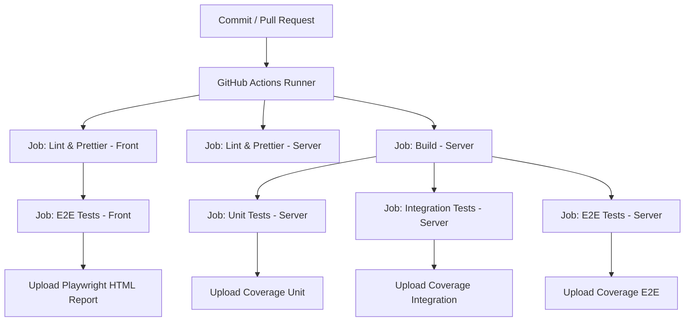

## Testes end-to-end no frontend

Este projeto demonstra como estruturar e executar testes end-to-end (E2E) no frontend com Playwright, Docker e CI/CD no GitHub Actions.
A aplicação é composta por Node.js/Express no backend e React + Vite no frontend, integrados a PostgreSQL e Redis.


--- 

### 🎯 O que são Testes E2E?

Testes end-to-end simulam o comportamento real do usuário, validando fluxos completos da aplicação, como:
- Registrar um novo usuário;
- Fazer login e navegar até o dashboard;
- Alterar a senha e manter a sessão válida;
- Tratar erros de autenticação (ex.: token inválido ou expirado);
Enquanto testes unitários validam funções isoladas e testes de integração verificam módulos combinados, os E2E garantem que frontend + backend + banco funcionam em conjunto como um sistema real.


---

### 🛠️ Tecnologias Utilizadas

- Node.js + Express – backend
- React + Vite – frontend
- PostgreSQL – persistência de dados
- Redis – blacklist de tokens JWT
- Playwright – framework de testes E2E
- Page Object Pattern (POP) – abstração para interações estáveis com a UI
- Nginx – servidor estático e proxy reverso `/api → backend`
- Docker & Docker Compose – isolamento de ambiente
- GitHub Actions – pipeline de CI/CD


---

### 📂 Estrutura de Pastas

```bash
app/
├── .github/
│   └── workflows/
│       └── ci.yml
│
├── db/                     
│   └── init.sql 
│
├── front/  
│   ├── src/                # Código do frontend (React + Vite)
│   ├── tests/
│   │   ├── e2e/            # Cenários de testes (specs)
│   │   │   ├── changePassword.spec.ts
│   │   │   ├── dashboard.spec.ts
│   │   │   ├── login.spec.ts
│   │   │   └── register.spec.ts
│   │   └── pages/          # Page Objects (POPs)
│   │       ├── ChangePasswordPage.ts
│   │       ├── DashboardPage.ts
│   │       ├── LoginPage.ts
│   │       └── RegisterPage.ts
│   ├── Dockerfile.e2e.front   # Build front + stage de testes Playwright
│   ├── Dockerfile.production
│   ├── nginx.e2e.conf         # Proxy API → node-e2e-front
│   ├── nginx.production.conf  # Proxy para ambiente produtivo
│   ├── package.json
│   └── playwright.config.ts   # Configuração Playwright
│
├── server/  
│   ├── src/                   # Código do backend        
│   ├── tests/                 # Unit, integration e e2e do backend 
│   │   ├── e2e/
│   │   ├── integration/        
│   │   └── unit/
│   │
│   ├── Dockerfile.e2e.front    # Usado por e2e da pasta front
│   ├── Dockerfile.e2e.server   # Usado por e2e da pasta server
│   ├── Dockerfile.integration
│   ├── Dockerfile.production
│   ├── Dockerfile.unit
│   ├── jest.integration.config.js
│   ├── jest.e2e.config.js
│   ├── jest.unit.config.js
│   └── package.json
│
├── .dockerignore
├── .env.e2e
├── .env.integration
├── .env.production
├── docker-compose.e2e-server.yml
├── docker-compose.integration.yml
├── docker-compose.production.yml
└── docker-compose.unit.yml

```


---

### ▶️ Execução Local


1. Clonar o repositório

```bash
git clone https://github.com/arleysouza/e2e-front-test.git app
cd app
```

2. Subir aplicação em modo de produção
```bash
docker compose -f docker-compose.yml up --build -d
```
Encerrar e remover containers
```bash
docker compose -f docker-compose.yml down -v
```

3. Gerar os certificados autoassinados no host
Crie a pasta `front/certs` e gere os certificados. Abaixo há instruções para PowerShell (Windows) e para Bash (Linux / macOS / Git Bash).

PowerShell (Windows):

```powershell
# criar pasta (execute na raiz do projeto)
mkdir .\front\certs

# gerar chave privada
openssl genrsa -out front\certs\privkey.pem 2048

# gerar certificado autoassinados (substitua /CN=localhost se quiser outro CN)
openssl req -x509 -nodes -days 365 -new -key front\certs\privkey.pem -out front\certs\fullchain.pem -subj "/CN=localhost"
```

Bash (Linux / macOS / Git Bash):

```bash
# criar pasta
mkdir -p front/certs

# gerar chave privada
openssl genrsa -out front/certs/privkey.pem 2048

# gerar certificado autoassinados
openssl req -x509 -nodes -days 365 -new -key front/certs/privkey.pem -out front/certs/fullchain.pem -subj "/CN=localhost"
```

Testes rápidos (PowerShell):

```powershell
# rebuild e subir (aplica o volume dos certificados)
docker compose -f docker-compose.yml up --build -d

# testar HTTPS no host (ignora verificação do certificado autoassinado)
curl -k https://localhost/

# verificar status do container e health
docker ps --filter "name=front-app" --format "table {{.Names}}\t{{.Status}}\t{{.Ports}}"
docker inspect --format "{{json .State.Health}}" front-app
```

Remover containers e volumes (PowerShell):

```powershell
docker compose -f docker-compose.yml down -v
```

Observação importante sobre o healthcheck

O `healthcheck` do serviço `front-app` faz uma requisição ao próprio Nginx dentro do container. Em alguns ambientes `localhost` resolve para o endereço IPv6 `::1`, e o Nginx pode não estar ouvindo em IPv6 — isto causaria falhas do tipo "Connection refused" no healthcheck. Para evitar esse problema recomendamos usar o endereço IPv4 explícito `127.0.0.1` no `docker-compose.yml` (o projeto já aplica essa recomendação):

```yaml
# exemplo no docker-compose.yml
healthcheck:
    test: ["CMD", "wget", "--quiet", "--tries=1", "--spider", "--no-check-certificate", "https://127.0.0.1:443/"]
    interval: 20s
    timeout: 10s
    retries: 5
```

Usando `127.0.0.1` o healthcheck evita problemas de resolução IPv6 e tende a marcar o container como `healthy` assim que o Nginx estiver servindo via HTTPS.


O arquivo `/http/requests.http` contém as requisições da aplicação (login, registro, logout, change password).  
Para executá-las diretamente no VSCode, instale a extensão:  
👉 REST Client (autor: Huachao Mao)  
Após instalar, basta abrir o arquivo `requests.http`, clicar em `Send Request` sobre a requisição desejada, e o VSCode mostrará a resposta no editor.  

No browser (vai avisar sobre certificado autoassinado):
HTTPS: https://localhost:3443
HTTP (se quiser): http://localhost:3002


Bloquear acesso direto ao backend (server-app)

Para fins de segurança e para a sua aula, o `server-app` foi configurado para NÃO publicar a porta para o host. Ou seja, o backend não estará acessível diretamente por uma URL do host — somente o `front-app` (Nginx) faz proxy das chamadas para `/api` internamente.

Verificações e comandos (PowerShell)

```powershell
# 1) Verificar se o backend não tem portas publicadas
docker ps --filter "name=node-app" --format "table {{.Names}}\t{{.Status}}\t{{.Ports}}"
# Saída esperada: node-app ... com coluna PORTS vazia (não há mapeamento para o host)

# 2) Tentar acessar o backend diretamente pelo host — deve falhar (connection refused / timeout)
curl http://localhost:3001/ -UseBasicParsing
# (3001 é o valor de SERVER_HOST_PORT do .env; sem mapeamento a porta não estará disponível no host)

# 3) Acessar o backend via front-app (proxy)
# HTTP via front
curl http://localhost:3002/api/health

# HTTPS via front (ignora certificado autoassinado)
curl -k https://localhost:3443/api/health
```

Explicação rápida
- Sem mapeamento de portas, o container `server-app` só fica acessível dentro da rede Docker `app-network`.
- O `front-app` (Nginx) atua como gateway e encaminha `/api` para `server-app:3000`. Isso permite aplicar TLS, políticas de CORS, cabeçalhos de segurança e outros controles apenas no proxy.
- Em produção, combine isso com políticas de firewall e um reverse-proxy central para rotear múltiplos serviços (SNI/hostnames) e gerenciar certificados reais.


---

### ⚙️ Configurações do Nginx

**Nginx**
- `nginx.production.conf` → Proxy `/api` → `node-app:3000`  
- `nginx.e2e.conf` → Proxy `/api` → `node-e2e-front:3000`  
    - usado para rodar Playwright em ambiente isolado.

 


---

### 🚀 Pipeline no GitHub Actions

O CI definido em `.github/workflows/ci.yml` roda os seguintes jobs:
- Lint & Prettier (Server) – verifica qualidade e formatação do código do backend;
- Lint & Prettier (Front) – verifica qualidade e formatação do código do frontend;
- Build (Server) – compila o TypeScript do backend.
- Unit Tests (Server) – roda com `docker-compose.unit.yml`, validando funções isoladas com mocks.
- Integration Tests (Server) – roda com `docker-compose.integration.yml`, garantindo interação entre módulos com Postgres e Redis reais.
- E2E Tests (Server) – roda com `docker-compose.e2e-server.yml`, simulando fluxos completos contra a API rodando em containers.
- E2E Tests (Front) – roda com `docker-compose.e2e-front.yml`, usando Playwright para validar a aplicação React servida pelo Nginx, integrada ao backend em containers.

Cada etapa publica relatórios de cobertura (`coverage/`) como artefatos no GitHub Actions (quando aplicável).



